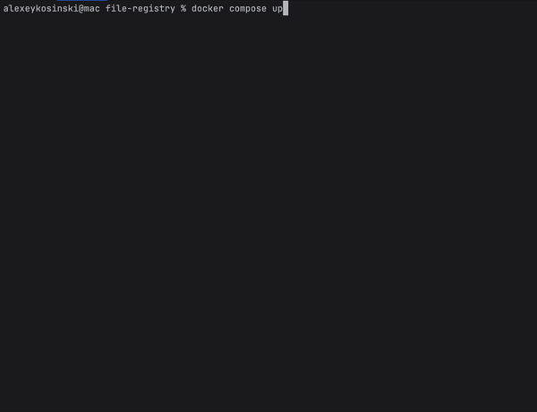
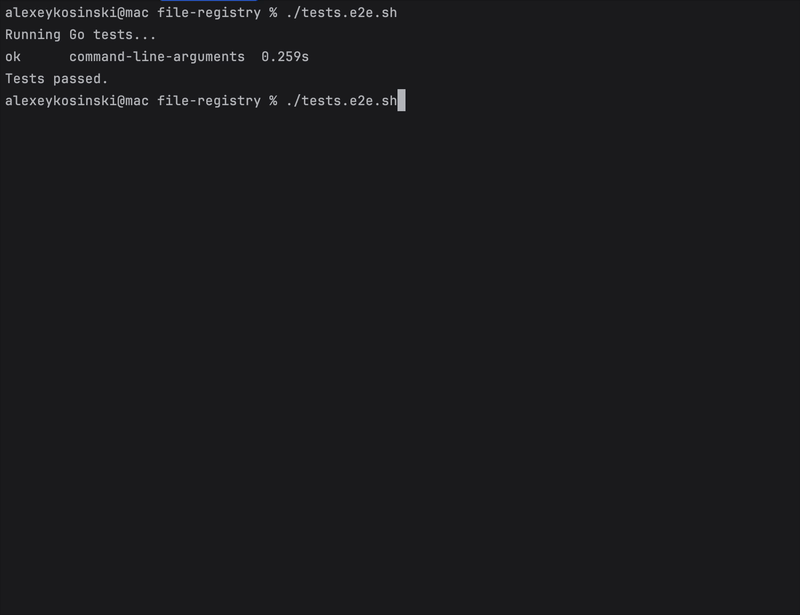
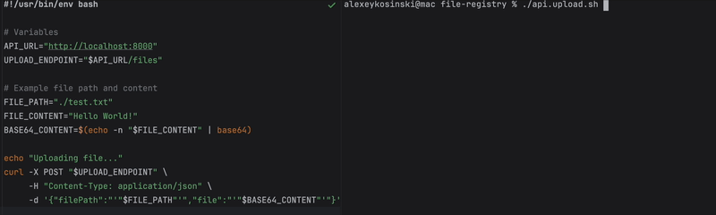
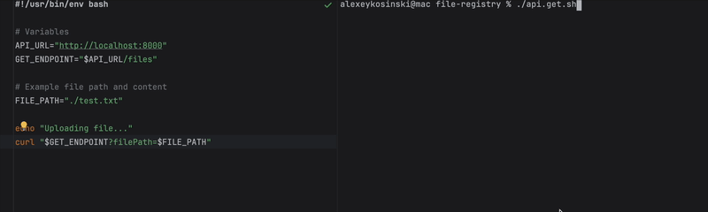

# File Registry API


## Table of Contents

- [Overview](#overview)
- [Features](#features)
- [Technologies Used](#technologies-used)
- [Prerequisites](#prerequisites)
- [Installation](#installation)
- [Configuration](#configuration)
- [Running the Application](#running-the-application)
- [Running Tests](#running-tests)
- [Project Structure](#project-structure)
- [Contributing](#contributing)
- [License](#license)

## Overview

**Go Ethereum-IPFS API** is a backend service built with Go, designed to interact seamlessly with Ethereum smart contracts and IPFS.

This API can be integrated into decentralized applications (dApps) requiring blockchain interactions and decentralized storage.

## Features

- **Environment Configuration:** Utilizes `.env` files and system environment variables for flexible configuration.
- **Ethereum Integration:** Connects to Ethereum nodes using `go-ethereum` for smart contract interactions.
- **IPFS Integration:** Interfaces with IPFS for decentralized file storage and retrieval.
- **Docker Support:** Easily containerized using Docker for consistent deployment environments.

## Technologies Used

- [Go](https://golang.org/) - Programming language
- [Ethereum Go Client](https://github.com/ethereum/go-ethereum) - Ethereum client implementation in Go
- [IPFS](https://ipfs.io/) - Decentralized storage system
- [Godotenv](https://github.com/joho/godotenv) - Loads environment variables from `.env` files
- [Envconfig](https://github.com/kelseyhightower/envconfig) - Processes environment variables into Go structs
- [Validator](https://github.com/go-playground/validator) - Validation library for Go structs
- [Testify](https://github.com/stretchr/testify) - Testing toolkit for Go
- [Docker](https://www.docker.com/) - Containerization platform

## Prerequisites

Before you begin, ensure you have met the following requirements:

- **Go:** Version 1.23 or higher installed. [Download Go](https://golang.org/dl/)
- **Git:** Installed on your machine. [Download Git](https://git-scm.com/downloads)
- **Docker (Optional):** If you plan to use Docker for running dependencies like Ethereum nodes or IPFS. [Download Docker](https://www.docker.com/get-started)
- **Access to an Ethereum Node:** Either a local node (e.g., Hardhat) or a remote provider (e.g., Infura).

## Installation

Follow these steps to set up the project locally.

1. **Clone the Repository**

   ```bash
   git clone https://github.com/avkos/file-registry
   cd file-registry
   ```


### Option 1: Using Docker

Execute the following command from the project's root directory:

```bash
  docker compose up
```

It will install hardhat, ipfs and api dependencies and start the services. Also compile, test and deploy the contract


### Option 2: Manual Setup
**Initialize Go Modules**

   ```bash
   cd api
   go mod tidy
   ```


## Running the Application

You can run the application directly using Go or use Docker to manage dependencies.

**Expected Output:**

    - The Ethereum node (`hardhat`) and IPFS node (`ipfs`) will start and map their respective ports.
    - The API service will build and start.
    - Logs will indicate successful loading of configurations and the API server running on the specified port.


### Option 1: Running Directly with Go
**Ensure Dependencies Are Running**

    - **Ethereum Node:** If you're using a local Ethereum node like Hardhat, ensure it's running.

      ```bash
      # Example with Hardhat
      cd hardhat
      npm i
      npm run start-node
      
      # in separate console compile and deploy the contract
      npm run compile
      npm run deploy
      ```

    - **IPFS Node:** Ensure your IPFS daemon is running.

      ```bash
      ipfs daemon
      ```
**Run the Application**

   Execute the following command from the project's root directory:

```bash
   cd api
   go mod tidy
```
This command will download all the necessary dependencies as specified in `go.mod`.

Configuration is managed through environment variables. You can set these variables in a `.env` file or directly in your system's environment.

```bash
   go run main.go
```


**Notes:**
- **CONTRACT_ADDRESS:** Ethereum smart contract address you intend to interact with.
- **ETH_RPC_URL:** RPC endpoint of your Ethereum node. For local development, Hardhat typically runs on `http://localhost:8545`.
- **IPFS_URL:** URL of your IPFS node. Local IPFS nodes usually run on `http://localhost:5001`.
- **PORT:** The port on which the API server will listen.
- **CHAIN_ID:** The ID of the Ethereum network you're connecting to. For local development with Hardhat, it's typically `31337`.
- **PRIVATE_KEY:** The private key of your Ethereum account. **Ensure this key is kept secure and never exposed publicly.**


## Running Tests
The project includes comprehensive tests to ensure that configuration loading works correctly under various scenarios. Tests cover unit tests and end-to-end tests, ensuring reliability and robustness.

Test Scripts
```bash
    ./tests.unit.sh #Unit Tests
    ./tests.e2e.sh #End-to-End Tests
```



Manually Calling the API
For manual testing and interaction with the API, the project provides the following scripts:
```bash
    ./api.upload.sh #Upload Data via API
    ./api.get.sh #Retrieve Data via API
```



## License

This project is licensed under the [MIT License](LICENSE).

---